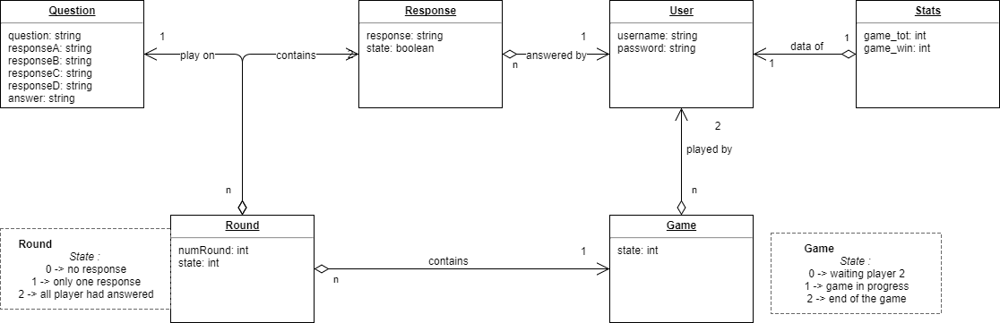

# QUIZZ

## Description
Quizz is a mobile application. It allow you to play against other online player.

## Database


This schema has been updated on 02/12/2018.

## Technologies
Symfony3.4 : API Rest backend ; use Doctrine 2
Android release "5<"

## REST API

<b>GET</b> /user?user=lucas : get the User object wich have lucas as username
```json
[
    {
        "id": 1,
        "username": "lucas"
    }
]
```

<b>GET</b> /game/all?user=1 : Get all games wich user 1 is player
```json
[
    {
        "id": 4,
        "state": 2,
        "adv": "florian",
        "winner": {
            "username": "lucas"
        },
        "pointsA": 3,
        "pointsB": 1
    },
    {
        "id": 6,
        "state": 1,
        "adv": "florian",
        "winner": null,
        "pointsA": null,
        "pointsB": null
    },
    {
        "id": 9,
        "state": 0,
        "adv": null,
        "winner": null,
        "pointsA": null,
        "pointsB": null
    }
]
```

<b>GET</b> /game?user=1 : User 1 start searching a game, but nobody is looking for

```json
{
    "id": 9,
    "state": 0,
    "adv": null,
    "winner": null,
    "pointsA": null,
    "pointsB": null
}
```

<b>GET</b> /game?user=2 : User 2 start searching a game and user "lucas" too

```json
{
    "game": {
        "id": 9,
        "state": 1,
        "adv": "lucas",
        "winner": null,
        "pointsA": null,
        "pointsB": null
    },
    "rounds": [
        {
            "id": 17,
            "numRound": 1,
            "question": {
                "id": 3,
                "question": "Moi ou toi ?",
                "responseA": "Moi",
                "responseB": "Toi",
                "responseC": "Lui",
                "responseD": "Et tous ceux qui le veulent",
                "answer": "ResponseA"
            }
        },
        {
            "id": 18,
            "numRound": 2,
            "question": {
                "id": 5,
                "question": "Bonjour ou pas du tout ?",
                "responseA": "Non",
                "responseB": "Chut",
                "responseC": "Bonjour",
                "responseD": "Lol",
                "answer": "ResponseB"
            }
        },
        {
            "id": 19,
            "numRound": 3,
            "question": {
                "id": 6,
                "question": "J'ai plus d'idée ?",
                "responseA": "Oui",
                "responseB": "C'est la galère",
                "responseC": "Non",
                "responseD": "Bonjour",
                "answer": "ResponseA"
            }
        }
    ]
}
```

<b>GET</b> /game/status?user=1&game=4 : User 1 is waiting for an user to play against, he send this request to know if someone
want to play, and there is someone

```json
{
    "game": {
        "id": 4,
        "state": 2,
        "adv": null,
        "winner": {
            "id": 1,
            "username": "lucas"
        },
        "pointsA": 3,
        "pointsB": 1
    },
    "rounds": [
        {
            "id": 6,
            "numRound": 1,
            "question": {
                "id": 1,
                "question": "L'oeuf ou la poule ?",
                "responseA": "L'oeuf",
                "responseB": "Poule",
                "responseC": "Chuck Norris",
                "responseD": "Jordan Ferri",
                "answer": "ResponseD"
            }
        },
        {
            "id": 7,
            "numRound": 2,
            "question": {
                "id": 5,
                "question": "Bonjour ou pas du tout ?",
                "responseA": "Non",
                "responseB": "Chut",
                "responseC": "Bonjour",
                "responseD": "Lol",
                "answer": "ResponseB"
            }
        },
        {
            "id": 8,
            "numRound": 3,
            "question": {
                "id": 2,
                "question": "Le ou la ?",
                "responseA": "Le",
                "responseB": "La",
                "responseC": "Non",
                "responseD": "Jordan Ferri",
                "answer": "ResponseC"
            }
        }
    ]
}
```

<b>POST</b> /response : send all response of the user 2 for the game 13
<i>BODY :</i>
```json
{
  "user": 2,
  "game": 13,
  "answers": [
    {
      "roundId": 32,
      "answer": "ResponseC"
    },
    {
      "roundId": 33,
      "answer": "ResponseB"
    },
    {
      "roundId": 34,
      "answer": "ResponseA"
    }
  ]
}
```
<i>RESPONSE : The user know that his adv won the game 3-2.</i>
```json
{
	"id": 13,
	"state": 2,
	"adv": "lucas",
	"winner": {
		"id": 1,
		"username": "lucas"
	},
	"pointsA": 3,
	"pointsB": 2
}
```

```json
{
    "game": {
        "id": 4,
        "state": 2,
        "adv": null,
        "winner": {
            "id": 1,
            "username": "lucas"
        },
        "pointsA": 3,
        "pointsB": 1
    },
    "rounds": [
        {
            "id": 6,
            "numRound": 1,
            "question": {
                "id": 1,
                "question": "L'oeuf ou la poule ?",
                "responseA": "L'oeuf",
                "responseB": "Poule",
                "responseC": "Chuck Norris",
                "responseD": "Jordan Ferri",
                "answer": "ResponseD"
            }
        },
        {
            "id": 7,
            "numRound": 2,
            "question": {
                "id": 5,
                "question": "Bonjour ou pas du tout ?",
                "responseA": "Non",
                "responseB": "Chut",
                "responseC": "Bonjour",
                "responseD": "Lol",
                "answer": "ResponseB"
            }
        },
        {
            "id": 8,
            "numRound": 3,
            "question": {
                "id": 2,
                "question": "Le ou la ?",
                "responseA": "Le",
                "responseB": "La",
                "responseC": "Non",
                "responseD": "Jordan Ferri",
                "answer": "ResponseC"
            }
        }
    ]
}
```